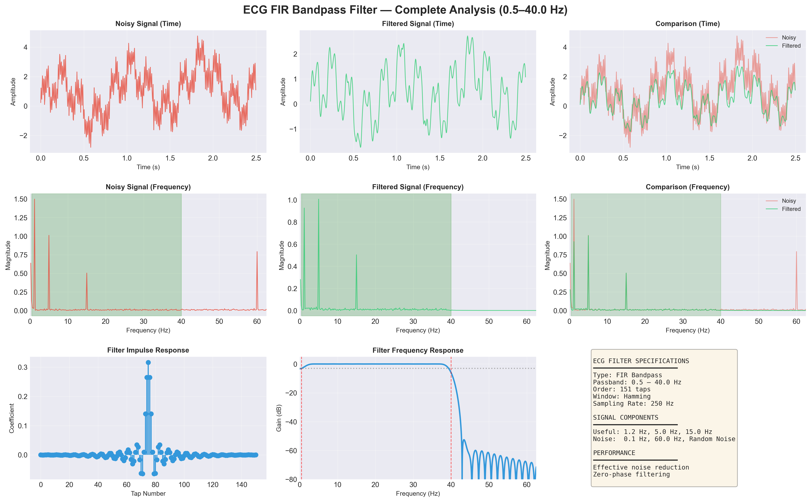
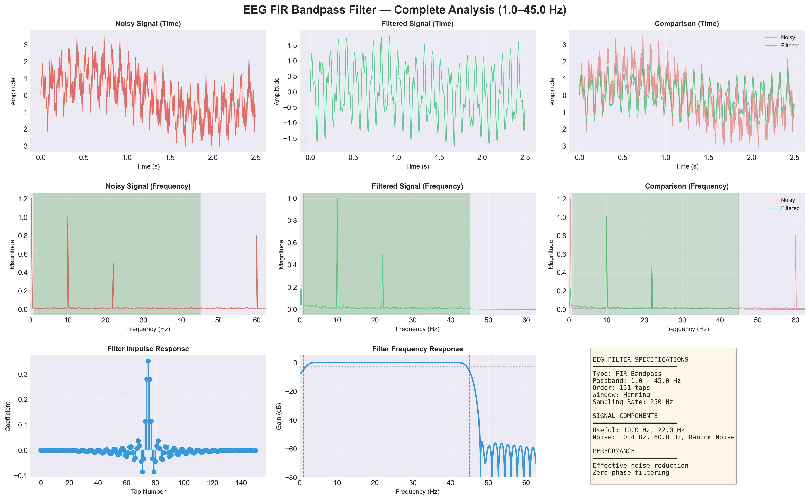
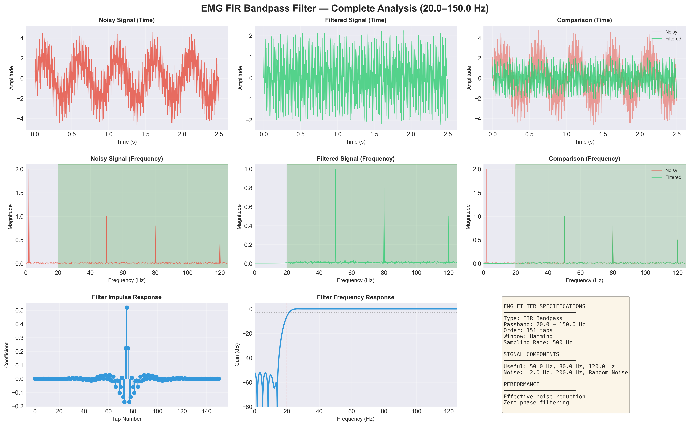

# NeuroLab Pro v3.0

[]()
[]()
[](https://www.electronjs.org/)
[](https://developer.mozilla.org/en-US/docs/Web/JavaScript)
[](https://www.python.org/)
[](./LICENSE)

**Comprehensive Biosignal Analysis & DSP Suite**

NeuroLab Pro is a high-performance tool for real-time and post-hoc analysis of biosignals such as **EMG, EEG, ECG, and EOG**. It combines a powerful custom DSP engine with a modern, responsive UI for detailed signal examination — available both as a **web app** (with PWA offline support) and a native **Windows desktop application**.

---


*Initial Workspace Layout*

---

## Table of Contents

- [Key Features](#key-features)
- [Screenshots](#screenshots)
- [Practical Usage Guide](./USAGE.md)
- [Getting Started](#getting-started)
  - [Web App (Browser)](#option-1-web-app-browser)
  - [Desktop App (Windows)](#option-2-desktop-app-windows)
  - [Build Desktop from Source](#build-desktop-from-source)
- [Python DSP Backend](#python-dsp-backend)
- [Keyboard Shortcuts](#keyboard-shortcuts)
- [Tech Stack](#tech-stack)
- [Project Structure](#project-structure)
- [Changelog](#changelog)
- [Contributing](#contributing)
- [Support](#support)
- [License](#license)

---

## Key Features

### High-Performance DSP Engine

- **Smart Downsampling (LTTB):** Effortlessly handle datasets with hundreds of thousands of points using the Largest Triangle Three Buckets algorithm for lag-free visualization.
- **Advanced Spectral Analysis:** Implements Welch's method for Power Spectral Density (PSD) calculation, providing smoother and more accurate frequency profiles than standard FFTs.
- **Zero-Phase Filtering:** Support for forward and backward passes (Butterworth High-Pass/Low-Pass) to eliminate phase shift — critical for timing-accurate biosignal analysis.
- **Precision Notch Filters:** Target specific interference frequencies (e.g., 50/60 Hz powerline noise) with adjustable Q-factors and multiple passes.
- **Time-Domain Tools:** Sliding window RMS Envelope (optimized for EMG) and Pan-Tompkins R-Peak detection (for ECG BPM/HRV).
- **EOG Gaze Detection:** Horizontal eye-movement classification (Left / Center / Right) with adaptive thresholding and ground-truth comparison.

### Advanced Visualization

- **Persistent Charting:** Custom implementation ensures chart instances are preserved across processing runs, eliminating flickers and preserving user state.
- **Multiple Layout Views:**
  - **Stacked:** Individual stages for detailed comparison.
  - **Overlay:** High-comparison view of all processing steps.
  - **Spectrum:** Comprehensive frequency domain analysis (Welch PSD).
  - **Spectrogram:** Time-frequency heatmaps (Short-Time FFT).
- **Interactive Controls:** Smooth mouse-wheel zoom, pan, and a high-precision crosshair readout showing raw, filtered, and noise delta values.

### Professional Workflow

- **Flexible CSV Parser:** Auto-detects columns (timestamp, signal, labels), skips annotations, handles multiple separators (comma, tab, semicolon, space), and supports multi-channel data (8–64 channels).
- **Annotation System:** Drop time-synced markers with labels directly on the signal.
- **Comprehensive Export:**
  - **Filtered CSV** — includes optional gaze direction timeline.
  - **Spectrum CSV** — frequency-domain Welch PSD data.
  - **Band Power JSON** — EEG band power metrics.
  - **WAV Audio** — 16-bit PCM export for audio-based analysis.
- **Audio Conversion:** Export your filtered biosignals as **16-bit PCM WAV** files without memory leaks via optimized blob handling.

---

## Screenshots


*Active EMG Analysis with Filtered Output and Frequency Content*

---

## Filter Demo Plots

Generated by `filter.py` — each modality has its own complete analysis:

### ECG (Electrocardiogram)


*ECG FIR Bandpass Filter Analysis (0.5–40 Hz)*

### EEG (Electroencephalogram)


*EEG FIR Bandpass Filter Analysis (1–45 Hz)*

### EMG (Electromyogram)


*EMG FIR Bandpass Filter Analysis (20–150 Hz)*

---

## Getting Started

### Option 1: Web App (Browser)

No installation required. Simply open the app in any modern browser:

1. **Clone the repo:**
   ```bash
   git clone https://github.com/Ndambia/fir-filter-demo.git
   cd fir-filter-demo
   ```
2. **Open the app:** Navigate to `Visualizer/` and open `index.html` in Chrome, Edge, Firefox, or any Chromium-based browser.
3. **Load Data:** Drag and drop your `.csv` or `.txt` signal file onto the window, or press `Ctrl+O`.
4. **Configure:** Use the left sidebar to enable filters and adjust parameters.
5. **Analyze:** Switch to the "Analysis" tab for Band Power (EEG), R-Peak (ECG), or EOG Gaze detection.
6. **Export:** Use the dropdown (or press `E` / `W`) to save your results.

> **PWA Support:** In Chrome/Edge, you can install NeuroLab Pro as a local app via the address bar install button for an offline, app-like experience. All assets (fonts, scripts, icons) are bundled locally — **no internet connection required** after installation.

---

### Option 2: Desktop App (Windows)

A pre-built Windows installer (`NeuroLab Pro Setup.exe`) is available in the **Releases** section of this repository.

1. Download the latest `.exe` installer from [GitHub Releases](https://github.com/Ndambia/fir-filter-demo/releases).
2. Run the installer and follow the setup wizard.
3. Launch **NeuroLab Pro** from the Start Menu or Desktop shortcut.

---

### Build Desktop from Source

The desktop application is powered by **Electron 29**. To build it yourself:

#### Prerequisites

- [Node.js](https://nodejs.org/) v18 or higher
- npm (included with Node.js)

#### Steps

```bash
# 1. Clone the repository
git clone https://github.com/Ndambia/fir-filter-demo.git
cd fir-filter-demo/electron

# 2. Install dependencies
npm install

# 3. Run in development mode (launches the desktop app directly)
npm start

# 4. Build the Windows installer (.exe)
npm run build
```

The installer will be output to `electron/dist/`. The build bundles the entire `Visualizer/` directory into a self-contained native app.

---

## Python DSP Backend

The repository also includes `filter.py` — a standalone **Python FIR filter demonstration script** that showcases the same DSP principles powering the web engine. It is useful for:

- **Prototyping** new filter configurations before porting to the JS engine.
- **Generating publication-quality plots** of signal filtering results.
- **Teaching/reference** — a step-by-step signal processing pipeline from noisy input to clean output.

### What It Does

The script generates synthetic multi-component biosignals for **ECG, EEG, and EMG**, intentionally corrupts them with realistic noise (powerline, baseline drift, random noise), designs and applies an appropriate FIR bandpass filter for each modality, and saves **27 analysis plots** (9 per modality) to `filter_demo_plots/`.

It also exports **sample CSV files** (`sample_data/ECG_sample.csv`, `EEG_sample.csv`, `EMG_sample.csv`) that can be directly loaded into NeuroLab Pro for interactive analysis.

### Signal Processing Profiles

| Modality | Passband | Useful Components | Noise Components |
|---|---|---|---|
| **ECG** | 0.5 – 40 Hz | 1.2 Hz (HR), 5 Hz, 15 Hz | 0.1 Hz drift, 60 Hz, random |
| **EEG** | 1 – 45 Hz | 10 Hz (Alpha), 22 Hz (Beta) | 0.4 Hz drift, 60 Hz, random |
| **EMG** | 20 – 150 Hz | 50 Hz, 80 Hz, 120 Hz | 2 Hz motion, 200 Hz interference, random |

### Filter Specs

| Parameter      | Value                      |
|----------------|----------------------------|
| Type           | FIR Bandpass               |
| Taps           | 151 (Hamming window)       |
| Sampling Rate  | 250 Hz (ECG/EEG), 500 Hz (EMG) |
| Implementation | `scipy.signal.filtfilt()`  |

### Setup & Run

```bash
# Install Python dependencies
pip install -r requirements.txt

# Run the filter demo
python filter.py
```

Outputs:
- **Plots:** `filter_demo_plots/ECG/`, `filter_demo_plots/EEG/`, `filter_demo_plots/EMG/` (9 PNGs each)
- **Sample Data:** `sample_data/ECG_sample.csv`, `EEG_sample.csv`, `EMG_sample.csv`

### Trying the Sample Data in NeuroLab Pro

1. Open NeuroLab Pro (web or desktop)
2. Drag and drop any `*_sample.csv` from the `sample_data/` folder
3. The app auto-detects the timestamp and signal columns
4. Configure filters to match the modality's passband and analyze!

### Customising the Filter

```python
# In filter.py — modify these values:
lowcut  = 3.0    # Low cutoff frequency (Hz)
highcut = 30.0   # High cutoff frequency (Hz)
numtaps = 101    # Filter order (more taps = sharper roll-off)
fs      = 2000    # Sampling rate of your signal
```

### Using With Your Own Data

```python
import numpy as np
from scipy import signal

your_signal = np.loadtxt('your_data.csv', delimiter=',')
fs = 250  # Your signal's sampling rate

fir_coeffs = signal.firwin(101, [3.0, 30.0],
                           pass_zero=False,
                           fs=fs,
                           window='hamming')

filtered = signal.filtfilt(fir_coeffs, 1.0, your_signal)
```

---

## Keyboard Shortcuts

| Shortcut | Action                           |
|----------|----------------------------------|
| `Ctrl+O` | Open / Load CSV Data             |
| `R`      | Re-run Signal Pipeline           |
| `1`      | Switch to **Stacked** View       |
| `2`      | Switch to **Overlay** View       |
| `3`      | Switch to **Spectrum** View      |
| `4`      | Switch to **Spectrogram** View   |
| `Space`  | Reset Zoom & Pan                 |
| `A`      | Quick-add Notch Filter           |
| `M`      | Toggle **Annotation Mode**       |
| `G`      | Run Horizontal **EOG Gaze Detection** |
| `E`      | Export Filtered CSV              |
| `W`      | Export Filtered WAV              |
| `?`      | Toggle Help Menu                 |
| `Escape` | Close Modal / Cancel Mode        |

---

## Tech Stack

### Visualizer (Web / Desktop)
- **Core:** Vanilla JavaScript (ES6+), HTML5, CSS3
- **DSP Engine:** Custom modular `engine.js` — zero external dependencies, highly optimized
- **Visualization:** [Chart.js 4.4](https://www.chartjs.org/) (loaded via CDN, cached by service worker)
- **Styling:** Dynamic CSS3 with Glassmorphism / Neon Aesthetics
- **Typography:** JetBrains Mono + Syne (bundled locally — no internet needed)
- **Desktop Wrapper:** [Electron 29](https://www.electronjs.org/) + `electron-builder`
- **Architecture:** PWA-ready with Service Worker for offline use. State management is elegantly separated from DOM rendering.

### Python Backend
- **Runtime:** Python 3.8+
- **DSP:** `scipy.signal` (FIR design, `filtfilt`)
- **Numerics:** `numpy`
- **Plotting:** `matplotlib`

---

## Project Structure

```
fir-filter-demo/
│
├── Visualizer/             # Core web application
│   ├── index.html          # App entry point (HTML + inline CSS)
│   ├── app.js              # Main UI logic (1251 lines, modular architecture)
│   ├── engine.js           # Custom DSP engine (952 lines — FFT, Welch, LTTB, Pan-Tompkins, EOG…)
│   ├── service-worker.js   # PWA offline support & asset caching
│   ├── manifest.json       # PWA manifest (installable app metadata)
│   ├── assets/fonts/       # Bundled JetBrains Mono + Syne fonts (no CDN)
│   ├── icons/              # PWA icons (192px, 512px)
│   └── Images/             # Screenshots and app assets
│
├── electron/               # Desktop application wrapper
│   ├── main.js             # Electron main process
│   ├── package.json        # Electron build configuration (NSIS installer)
│   └── src/                # Bundled app source + icons
│
├── filter_demo_plots/      # Generated analysis plots (27 total)
│   ├── ECG/                # 9 ECG filter analysis plots
│   ├── EEG/                # 9 EEG filter analysis plots
│   └── EMG/                # 9 EMG filter analysis plots
│
├── sample_data/            # Sample CSV files for NeuroLab Pro
│   ├── ECG_sample.csv      # Synthetic ECG signal (250 Hz, 5 sec)
│   ├── EEG_sample.csv      # Synthetic EEG signal (250 Hz, 5 sec)
│   └── EMG_sample.csv      # Synthetic EMG signal (500 Hz, 5 sec)
│
├── filter.py               # Python FIR filter demo (ECG/EEG/EMG)
├── requirements.txt        # Python dependencies (numpy, scipy, matplotlib)
├── USAGE.md                # Practical usage guide for researchers
├── LICENSE                 # MIT License
├── .gitignore              # Excludes node_modules, dist, caches
├── .gitattributes          # Git LFS config for large binaries
└── README.md               # This file
```

---

## Changelog

### v3.0.0 — Current Release
- **EOG Gaze Detection** — horizontal saccade classifier with ground-truth comparison
- **Multi-channel CSV support** — parse files with 8–64 signal channels
- **Band Power Analysis** — delta/theta/alpha/beta/gamma power with JSON export
- **Spectrogram view** — STFT-based time-frequency heatmaps
- **PWA with full offline support** — all fonts, icons, and scripts bundled locally
- **Electron desktop app** — NSIS Windows installer via `electron-builder`
- **Smart CSV parser** — auto-detects timestamp/signal/label columns, handles comma/tab/semicolon/space separators
- **Zero-phase filtering** — forward+backward IIR passes for timing-accurate biosignal analysis
- **WAV export** — 16-bit PCM with memory-safe blob handling
- **Comprehensive annotation system** — time-synced markers with labels

---

## Contributing

Contributions are welcome!

1. **Fork** the repository
2. **Create** a feature branch (`git checkout -b feature/YourFeature`)
3. **Commit** your changes (`git commit -m 'Add YourFeature'`)
4. **Push** to the branch (`git push origin feature/YourFeature`)
5. **Open** a Pull Request

### Ideas for Contributions

- Additional biosignal example datasets
- More DSP algorithms (adaptive filtering, ICA)
- Mobile / touch-optimised UI
- Export to EDF/BDF formats
- Linux / macOS Electron builds

---

## Support

- **Bug Reports:** [Open an issue](https://github.com/Ndambia/fir-filter-demo/issues)
- **Feature Requests:** [Start a discussion](https://github.com/Ndambia/fir-filter-demo/discussions)
- **Email:** brianndambia6@gmail.com

---

## License

MIT License — see [LICENSE](./LICENSE) for details.

---

**Designed for Researchers, Biohackers, and Engineers.**
Made with ❤️ by [@Ndambia](https://github.com/Ndambia)
