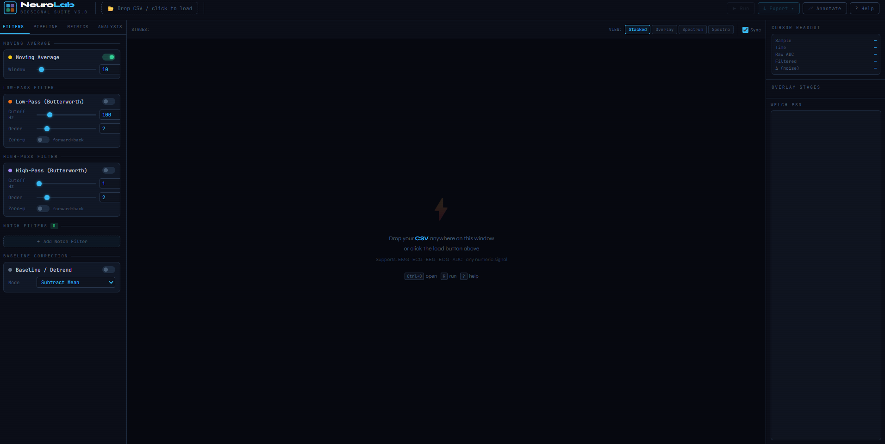
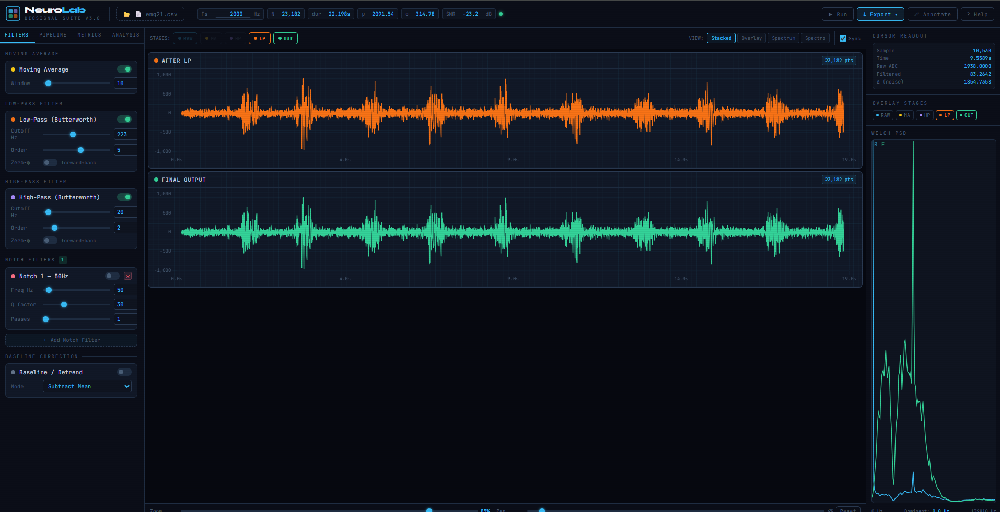

# NeuroLab Pro v3.0

[]()
[]()
[](https://www.electronjs.org/)
[](https://developer.mozilla.org/en-US/docs/Web/JavaScript)
[](https://www.python.org/)
[](./LICENSE)

**Comprehensive Biosignal Analysis & DSP Suite**

NeuroLab Pro is a high-performance tool for real-time and post-hoc analysis of biosignals such as **EMG, EEG, and EOG**. It combines a powerful custom DSP engine with a modern, responsive UI for detailed signal examination — available both as a **web app** and a native **Windows desktop application**.

---


*Initial Workspace Layout*

---

## Table of Contents

- [Key Features](#key-features)
- [Screenshots](#screenshots)
- [Practical Usage Guide](./USAGE.md)
- [Getting Started](#getting-started)
  - [Web App (Browser)](#option-1-web-app-browser)
  - [Desktop App (Windows)](#option-2-desktop-app-windows)
  - [Build Desktop from Source](#build-desktop-from-source)
- [Python DSP Backend](#python-dsp-backend)
- [Keyboard Shortcuts](#keyboard-shortcuts)
- [Tech Stack](#tech-stack)
- [Project Structure](#project-structure)
- [Contributing](#contributing)

---

## Key Features

### High-Performance DSP Engine

- **Smart Downsampling (LTTB):** Effortlessly handle datasets with hundreds of thousands of points using the Largest Triangle Three Buckets algorithm for lag-free visualization.
- **Advanced Spectral Analysis:** Implements Welch's method for Power Spectral Density (PSD) calculation, providing smoother and more accurate frequency profiles than standard FFTs.
- **Zero-Phase Filtering:** Support for forward and backward passes (Butterworth High-Pass/Low-Pass) to eliminate phase shift — critical for timing-accurate biosignal analysis.
- **Precision Notch Filters:** Target specific interference frequencies (e.g., 50/60 Hz powerline noise) with adjustable Q-factors and multiple passes.
- **Time-Domain Tools:** Sliding window RMS Envelope (optimized for EMG) and Pan-Tompkins R-Peak detection (for ECG BPM/HRV).

### Advanced Visualization

- **Persistent Charting:** Custom implementation ensures chart instances are preserved across processing runs, eliminating flickers and preserving user state.
- **Multiple Layout Views:**
  - **Stacked:** Individual stages for detailed comparison.
  - **Overlay:** High-comparison view of all processing steps.
  - **Spectrum:** Comprehensive frequency domain analysis.
  - **Spectrogram:** Time-frequency heatmaps (STFT).
- **Interactive Controls:** Smooth mouse-wheel zoom, pan, and a high-precision crosshair readout showing raw, filtered, and noise delta values.

### Professional Workflow

- **Flexible CSV Parser:** Auto-detects columns, skips labels/annotations, and handles multiple separators.
- **Annotation System:** Drop time-synced markers with labels directly on the signal.
- **Comprehensive Export:** Export processed data to **CSV**, frequency data to **Spectrum CSV**, or timing/power metrics to **JSON**.
- **Audio Conversion:** Export your filtered biosignals as **16-bit PCM WAV** files for audio-based analysis.

---

## Screenshots


*Active EMG Analysis with Filtered Output and Frequency Content*

---

## Getting Started

### Option 1: Web App (Browser)

No installation required. Simply open the app in any modern browser:

1. Navigate to the `Visualizer/` directory.
2. Open `index.html` in Chrome, Edge, Firefox, or any Chromium-based browser.
3. **Load Data:** Drag and drop your `.csv` or `.txt` signal file onto the window.
4. **Configure:** Use the left sidebar to enable filters and adjust parameters.
5. **Analyze:** Switch to the "Analysis" tab for Band Power (EEG) or R-Peak (ECG) detection.
6. **Export:** Use the dropdown to save your results.

> The app is **PWA-ready** — in Chrome/Edge you can install it locally via the address bar install button for an offline, app-like experience.

---

### Option 2: Desktop App (Windows)

A pre-built Windows installer (`NeuroLab Pro Setup.exe`) is available in the **Releases** section of this repository.

1. Download the latest `.exe` installer from [GitHub Releases](https://github.com/Ndambia/fir-filter-demo/releases).
2. Run the installer and follow the setup wizard.
3. Launch **NeuroLab Pro** from the Start Menu or Desktop shortcut.

---

### Build Desktop from Source

The desktop application is powered by **Electron 29**. To build it yourself:

#### Prerequisites

- [Node.js](https://nodejs.org/) v18 or higher
- npm (included with Node.js)

#### Steps

```bash
# 1. Clone the repository
git clone https://github.com/Ndambia/fir-filter-demo.git
cd fir-filter-demo/electron

# 2. Install dependencies
npm install

# 3. Run in development mode (launches the desktop app directly)
npm start

# 4. Build the Windows installer (.exe)
npm run build
```

The installer will be output to `electron/dist/`. The build bundles the entire `Visualizer/` directory into a self-contained native app.

---

## Python DSP Backend

The repository also includes `filter.py` — a standalone **Python FIR filter demonstration script** that showcases the same DSP principles powering the web engine. It is useful for:

- **Prototyping** new filter configurations before porting to the JS engine.
- **Generating publication-quality plots** of signal filtering results.
- **Teaching/reference** — a step-by-step signal processing pipeline from noisy input to clean output.

### What It Does

The script generates a synthetic multi-component biosignal, intentionally corrupts it with realistic noise (60 Hz powerline, 0.5 Hz baseline drift, random noise), designs and applies an FIR bandpass filter (3–30 Hz), and saves **9 analysis plots** to `filter_demo_plots/`.

### Signal Components

| Component         | Frequency | Amplitude | Category    |
|-------------------|-----------|-----------|-------------|
| Useful Signal #1  | 5 Hz      | 1.5       | Preserved   |
| Useful Signal #2  | 15 Hz     | 1.0       | Preserved   |
| Useful Signal #3  | 25 Hz     | 0.8       | Preserved   |
| Baseline Drift    | 0.5 Hz    | 0.3       | Removed     |
| Powerline Noise   | 60 Hz     | 0.5       | Removed     |
| Random Noise      | Broadband | 0.3       | Attenuated  |

### Filter Specs

| Parameter      | Value                      |
|----------------|----------------------------|
| Type           | FIR Bandpass               |
| Passband       | 3 – 30 Hz                  |
| Taps           | 101 (Hamming window)       |
| Sampling Rate  | 200 Hz                     |
| Implementation | `scipy.signal.filtfilt()`  |

### Setup & Run

```bash
# Install Python dependencies
pip install -r requirement.txt

# Run the filter demo
python filter.py
```

Outputs are saved to `filter_demo_plots/` (9 PNG files).

### Customising the Filter

```python
# In filter.py — modify these values:
lowcut  = 3.0    # Low cutoff frequency (Hz)
highcut = 30.0   # High cutoff frequency (Hz)
numtaps = 101    # Filter order (more taps = sharper roll-off)
fs      = 2000    # Sampling rate of your signal
```

### Using With Your Own Data

```python
import numpy as np
from scipy import signal

your_signal = np.loadtxt('your_data.csv', delimiter=',')
fs = 250  # Your signal's sampling rate

fir_coeffs = signal.firwin(101, [3.0, 30.0],
                           pass_zero=False,
                           fs=fs,
                           window='hamming')

filtered = signal.filtfilt(fir_coeffs, 1.0, your_signal)
```

---

## Keyboard Shortcuts

| Shortcut | Action                           |
|----------|----------------------------------|
| `Ctrl+O` | Open / Load CSV Data             |
| `R`      | Re-run Signal Pipeline           |
| `1`      | Switch to **Stacked** View       |
| `2`      | Switch to **Overlay** View       |
| `3`      | Switch to **Spectrum** View      |
| `4`      | Switch to **Spectrogram** View   |
| `Space`  | Reset Zoom & Pan                 |
| `A`      | Quick-add Notch Filter           |
| `M`      | Toggle **Annotation Mode**       |
| `E`      | Export Filtered CSV              |
| `W`      | Export Filtered WAV              |
| `?`      | Toggle Help Menu                 |

---

## Tech Stack

### Visualizer (Web / Desktop)
- **Core:** Vanilla JavaScript (ES6+), HTML5, CSS3
- **DSP Engine:** Custom `engine.js` — zero external dependencies
- **Visualization:** [Chart.js](https://www.chartjs.org/)
- **Styling:** Dynamic CSS3 with Glassmorphism / Neon Aesthetics
- **Desktop Wrapper:** [Electron 29](https://www.electronjs.org/) + `electron-builder`
- **Architecture:** PWA-ready with Service Worker for offline use

### Python Backend
- **Runtime:** Python 3.8+
- **DSP:** `scipy.signal` (FIR design, `filtfilt`)
- **Numerics:** `numpy`
- **Plotting:** `matplotlib`

---

## Project Structure

```
fir-filter-demo/
│
├── Visualizer/             # Core web application
│   ├── index.html          # App entry point
│   ├── app.js              # Main UI logic
│   ├── engine.js           # Custom DSP engine (LTTB, Welch, Pan-Tompkins…)
│   ├── service-worker.js   # PWA offline support
│   ├── manifest.json       # PWA manifest
│   └── Images/             # Screenshots and app assets
│
├── electron/               # Desktop application wrapper
│   ├── main.js             # Electron main process
│   ├── package.json        # Electron build configuration
│   └── src/                # Icons and build resources
│
├── filter.py               # Python FIR filter demonstration script
├── requirement.txt         # Python dependencies
├── .gitignore              # Excludes node_modules, dist, caches, plots
└── README.md               # This file
```

---

## Contributing

Contributions are welcome!

1. **Fork** the repository
2. **Create** a feature branch (`git checkout -b feature/YourFeature`)
3. **Commit** your changes (`git commit -m 'Add YourFeature'`)
4. **Push** to the branch (`git push origin feature/YourFeature`)
5. **Open** a Pull Request

### Ideas for Contributions

- Additional biosignal example datasets
- More DSP algorithms (adaptive filtering, ICA)
- Mobile / touch-optimised UI
- Export to EDF/BDF formats

---

## Support

- **Bug Reports:** [Open an issue](https://github.com/Ndambia/fir-filter-demo/issues)
- **Feature Requests:** [Start a discussion](https://github.com/Ndambia/fir-filter-demo/discussions)
- **Email:** brianndambia6@gmail.com

---

## License

MIT License — see [LICENSE](./LICENSE) for details.

---

**Designed for Researchers, Biohackers, and Engineers.**
Made with ❤️ by [@Ndambia](https://github.com/Ndambia)
