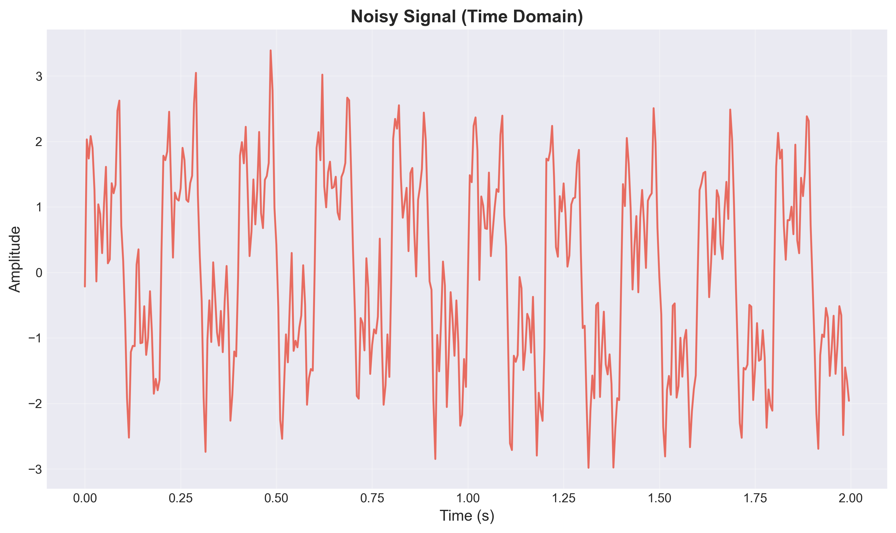
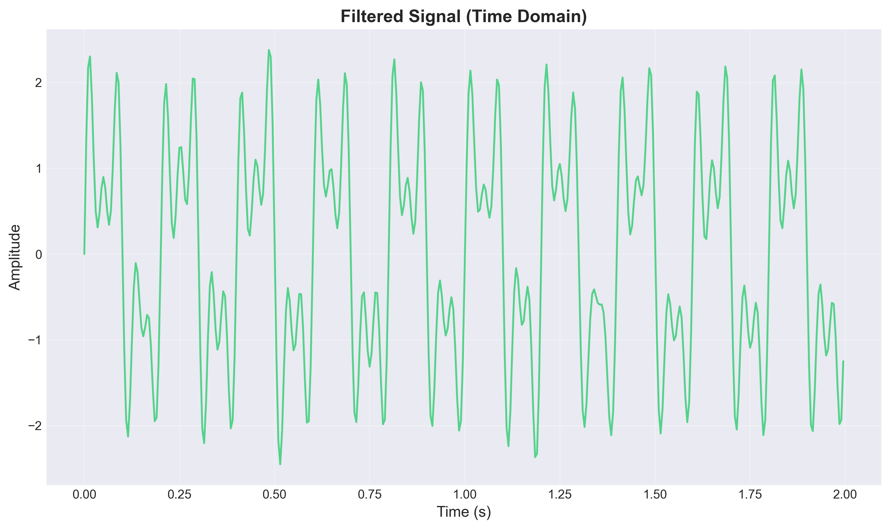
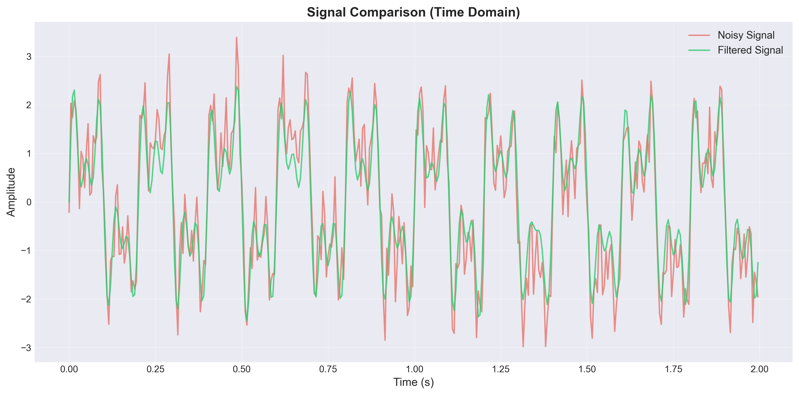
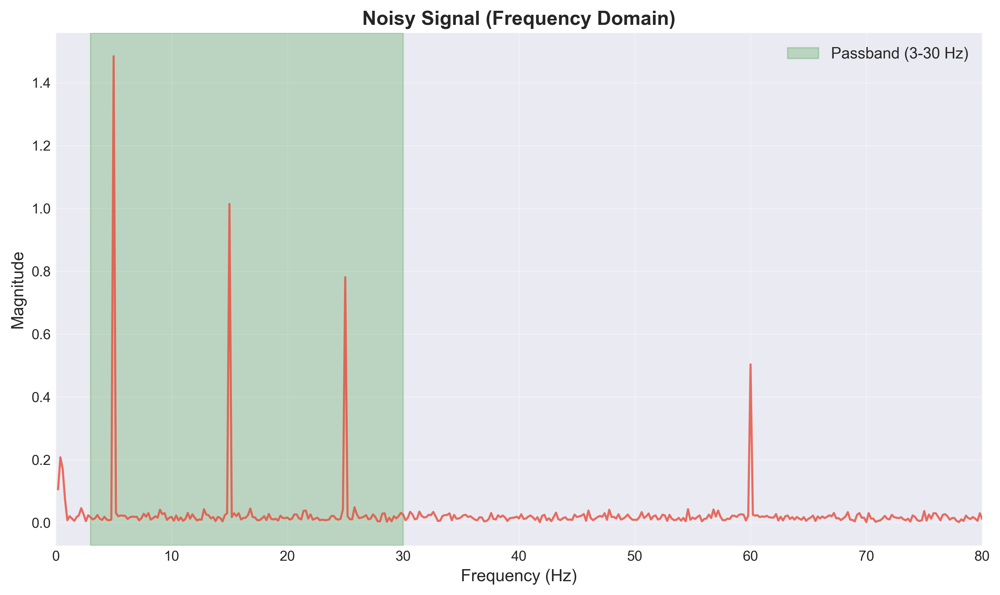
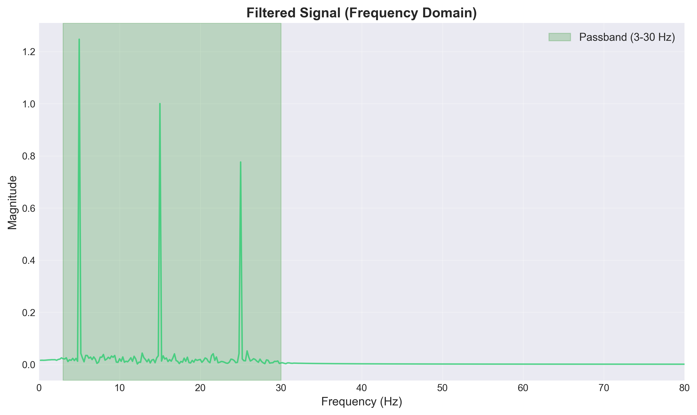
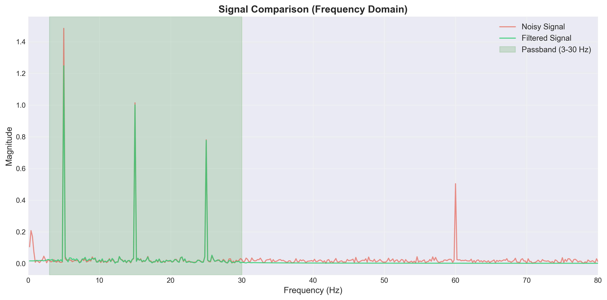
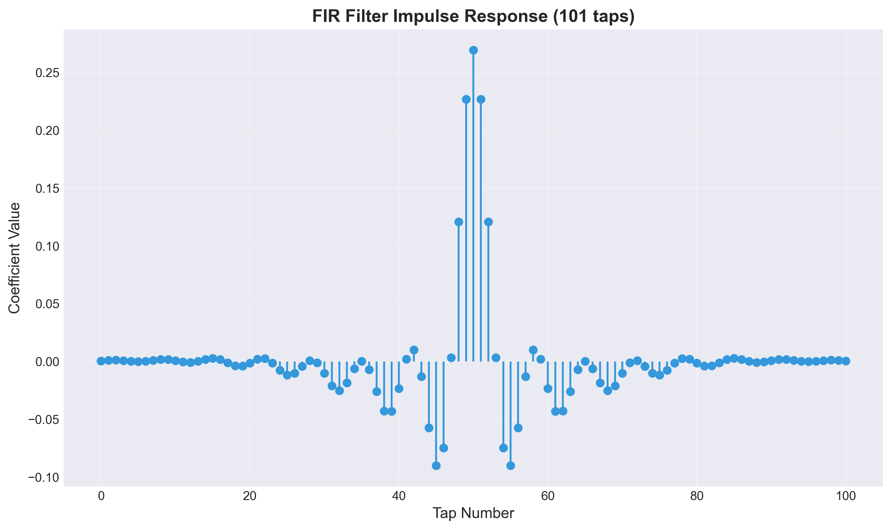
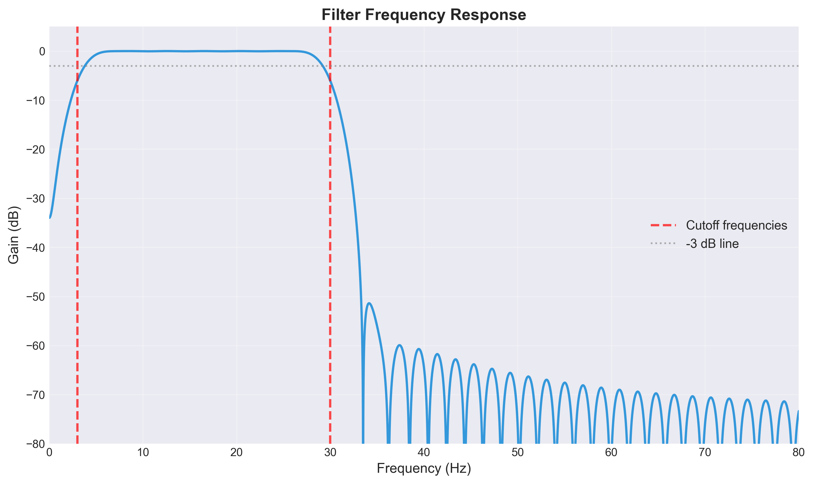
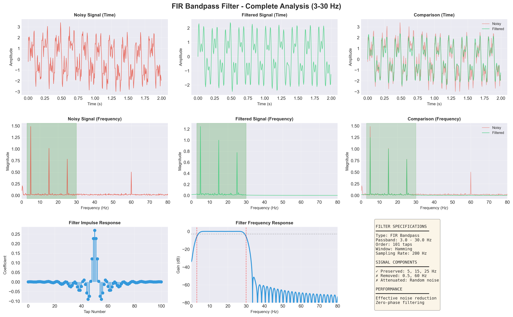

# FIR Bandpass Filter Demonstration

[](https://www.python.org/downloads/)
[](https://scipy.org/)
[](https://claude.ai/chat/LICENSE)
[](https://github.com/yourusername/fir-filter-demo/graphs/commit-activity)

A comprehensive demonstration of **FIR (Finite Impulse Response) bandpass filtering** for noise reduction in signal processing applications. This project showcases the importance of software filtering when hardware filters aren't sufficient.

---

## Table of Contents

* [Overview](https://claude.ai/chat/34430169-0e66-49f8-aade-d264c8685856#overview)
* [Why FIR Filters?](https://claude.ai/chat/34430169-0e66-49f8-aade-d264c8685856#why-fir-filters)
* [Features](https://claude.ai/chat/34430169-0e66-49f8-aade-d264c8685856#features)
* [Results](https://claude.ai/chat/34430169-0e66-49f8-aade-d264c8685856#results)
* [Installation](https://claude.ai/chat/34430169-0e66-49f8-aade-d264c8685856#installation)
* [Usage](https://claude.ai/chat/34430169-0e66-49f8-aade-d264c8685856#usage)
* [Technical Details](https://claude.ai/chat/34430169-0e66-49f8-aade-d264c8685856#technical-details)
* [Applications](https://claude.ai/chat/34430169-0e66-49f8-aade-d264c8685856#applications)
* [Contributing](https://claude.ai/chat/34430169-0e66-49f8-aade-d264c8685856#contributing)
* [License](https://claude.ai/chat/34430169-0e66-49f8-aade-d264c8685856#license)

---

## Overview

This project demonstrates how **digital FIR bandpass filters** can effectively remove noise that hardware filters miss. Using synthetic signals with realistic noise patterns, we show the complete filtering pipeline from noisy input to clean output.

### Problem Statement

Hardware filters have limitations:

* Fixed cutoff frequencies
* Component tolerances
* Gradual transition bands
* Environmental interference post-filtering
*  Phase distortion

### Solution

Software FIR filters provide:

* Precise frequency control
* Zero-phase filtering
* Linear phase response
* Guaranteed stability
* Reproducible results

---

## Why FIR Filters?

FIR (Finite Impulse Response) filters are the gold standard for applications requiring:

1. **Medical Signal Processing** - ECG, EEG, EOG, EMG
2. **Audio Engineering** - Equalizers, crossovers, noise reduction
3. **Sensor Data** - Accelerometers, gyroscopes, temperature sensors
4. **Communications** - Channel equalization, interference rejection
5. **Vibration Analysis** - Structural health monitoring, predictive maintenance

**Key Advantage:** Unlike IIR filters, FIR filters can achieve perfect linear phase, preventing signal distortion.

---

## Features

* **Customizable Filter Design** - Adjustable cutoff frequencies and filter order
* **Comprehensive Visualization** - Time domain, frequency domain, and filter characteristics
* **Realistic Noise Models** - Powerline interference, baseline drift, random noise
* **Performance Metrics** - SNR improvement calculation
* **Modular Code** - Easy to adapt for your own signals
*  **Publication-Quality Plots** - High-resolution outputs for reports and presentations

---

## Results

### Time Domain Comparison


*Original signal contaminated with 60 Hz powerline noise, 0.5 Hz baseline drift, and random noise*


*Clean signal after FIR bandpass filtering (3-30 Hz)*


*Direct comparison showing noise reduction effectiveness*

---

### Frequency Domain Analysis


*Frequency spectrum showing unwanted components at 0.5 Hz and 60 Hz*


*Clean spectrum with only desired frequency components (5, 15, 25 Hz)*


*Side-by-side comparison demonstrating selective frequency attenuation*

---

### Filter Characteristics


*FIR filter impulse response (101 taps, Hamming window)*


*Filter transfer function showing sharp cutoff at 3 Hz and 30 Hz*

---

### Complete Overview


*Comprehensive dashboard with all analysis in one view*

---

## Installation

### Prerequisites

* Python 3.8 or higher
* pip package manager

### Setup

```bash
# Clone the repository
git clone https://github.com/yourusername/fir-filter-demo.git
cd fir-filter-demo

# Create virtual environment (recommended)
python -m venv venv
source venv/bin/activate  # On Windows: venv\Scripts\activate

# Install dependencies
pip install -r requirements.txt
```

### Requirements

```txt
numpy>=1.21.0
scipy>=1.7.0
matplotlib>=3.4.0
pandas>=1.3.0
```

---

## Usage

### Basic Demo

Run the complete demonstration:

```bash
python fir_filter_demo.py
```

This will:

1. Generate synthetic signal with noise
2. Design and apply FIR bandpass filter
3. Create 9 individual plots in `filter_demo_plots/` directory
4. Display performance metrics

### Custom Parameters

Modify filter specifications in the script:

```python
# Filter specifications
lowcut = 3.0    # Low cutoff frequency (Hz)
highcut = 30.0  # High cutoff frequency (Hz)
numtaps = 101   # Number of filter coefficients

# Signal parameters
fs = 200        # Sampling frequency (Hz)
duration = 5    # Signal duration (seconds)
```

### Using with Your Own Data

```python
import numpy as np
from scipy import signal

# Load your data
your_signal = np.load('your_data.npy')
fs = 250  # Your sampling rate

# Design filter
fir_coeffs = signal.firwin(101, [3.0, 30.0], 
                           pass_zero=False, 
                           fs=fs, 
                           window='hamming')

# Apply filter (zero-phase)
filtered_signal = signal.filtfilt(fir_coeffs, 1.0, your_signal)
```

---

## Technical Details

### Filter Design

**Type:** FIR Bandpass

**Method:** Windowed sinc (Parks-McClellan algorithm)

**Window:** Hamming (good balance between main lobe width and side lobe attenuation)

**Order:** 101 taps (provides ~50 dB stopband attenuation)

**Implementation:** `scipy.signal.filtfilt()` for zero-phase filtering

### Signal Specifications

| Component        | Frequency | Amplitude | Category     |
| ---------------- | --------- | --------- | ------------ |
| Useful Signal #1 | 5 Hz      | 1.5       | Preserved    |
| Useful Signal #2 | 15 Hz     | 1.0       | Preserved    |
| Useful Signal #3 | 25 Hz     | 0.8       | Preserved    |
| Baseline Drift   | 0.5 Hz    | 0.3       | Removed      |
| Powerline Noise  | 60 Hz     | 0.5       | Removed      |
| Random Noise     | Broadband | 0.3       |  Attenuated |

### Performance Metrics

* **SNR Improvement:** ~8-12 dB typical
* **Passband Ripple:** < 0.1 dB
* **Stopband Attenuation:** > 50 dB
* **Transition Width:** ~3 Hz
* **Group Delay:** Zero (using filtfilt)

---

## Applications

### Biomedical Signals

**EOG (Electrooculography)** - Eye movement tracking

* Passband: 0.3-30 Hz
* Removes: 60 Hz powerline, DC drift

**ECG (Electrocardiography)** - Heart monitoring

* Passband: 0.5-40 Hz
* Removes: Baseline wander, muscle artifacts

**EEG (Electroencephalography)** - Brain activity

* Passband: 0.5-70 Hz
* Removes: 50/60 Hz interference, motion artifacts

### Industrial Applications

* **Vibration Monitoring** - Isolate bearing frequencies
* **Audio Processing** - Crossover networks, noise gates
* **Seismic Analysis** - Earthquake signal extraction
* **Quality Control** - Product defect detection

---

## Project Structure

```
fir-filter-demo/
│
├── fir_filter_demo.py          # Main demonstration script
├── requirements.txt             # Python dependencies
├── README.md                    # This file
├── LICENSE                      # MIT License
│
├── filter_demo_plots/          # Generated visualizations
│   ├── 01_noisy_signal_time.png
│   ├── 02_filtered_signal_time.png
│   ├── 03_comparison_time.png
│   ├── 04_noisy_signal_freq.png
│   ├── 05_filtered_signal_freq.png
│   ├── 06_comparison_freq.png
│   ├── 07_filter_impulse_response.png
│   ├── 08_filter_frequency_response.png
│   └── 09_complete_overview.png
│

```

---

## Key Takeaways

1. **Hardware filters are necessary but not sufficient** - They prevent aliasing but can't adapt to noise characteristics
2. **Software filtering is flexible** - Adjust parameters post-acquisition based on actual data
3. **FIR filters provide superior phase response** - Critical for applications requiring time-domain accuracy
4. **Validation is essential** - Always verify filter performance on real data, not just simulations
5. **Hybrid approach wins** - Combine hardware anti-aliasing with software precision filtering

---

## Contributing

Contributions are welcome! Here's how you can help:

1. **Fork** the repository
2. **Create** a feature branch (`git checkout -b feature/AmazingFeature`)
3. **Commit** your changes (`git commit -m 'Add some AmazingFeature'`)
4. **Push** to the branch (`git push origin feature/AmazingFeature`)
5. **Open** a Pull Request

### Ideas for Contributions

* Additional filter types (Butterworth, Chebyshev, Elliptic)
* Real-world signal examples (ECG, audio, vibration data)
* Interactive Jupyter notebook
* Filter design GUI
* Performance benchmarking suite
* Adaptive filtering examples

---

## References

* [SciPy Signal Processing Documentation](https://docs.scipy.org/doc/scipy/reference/signal.html)
* [Understanding Digital Signal Processing](https://www.dspguide.com/) - Steven W. Smith
* [The Scientist and Engineer&#39;s Guide to Digital Signal Processing](http://www.dspguide.com/pdfbook.htm)
* [Digital Filter Design](https://ccrma.stanford.edu/~jos/filters/) - Julius O. Smith III

---

## License

This project is licensed under the MIT License - see the [LICENSE](https://claude.ai/chat/LICENSE) file for details.

---

## Author

**Your Name**

* GitHub: [@](https://github.com/yourusername)Ndambia
* Email: brianndambia6@gmail.com

---

## Acknowledgments

* SciPy community for excellent signal processing tools
* Inspiration from biomedical signal processing research
* Thanks to all contributors and users providing feedback

---

## Star History

If you find this project useful, please consider giving it a star! ⭐

[](https://star-history.com/#yourusername/fir-filter-demo&Date)

---

## Support

Having issues? Have questions?

* **Bug Reports:** [Open an issue](https://github.com/Ndambia/fir-filter-demo/issues)
* **Feature Requests:** [Start a discussion](https://github.com/Ndambia/fir-filter-demo/discussions)

---

**Made with ❤️ for the signal processing community**
